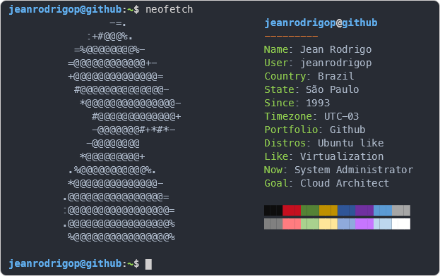

# Hello Git!

###

    
  

###

  
  
  
  
  
  
  
  
    
  
    
  
    

</table>

###

<h1></h1>

SysAdmin Trainee.

"Knowledge is the information analyzed, understood and incorporated. Wisdom is knowledge submitted to the judgment of values, beliefs, ethics and morals. Therefore, there is no wisdom without knowledge, nor knowledge without information, we can say that they are given in stages. different processing. "

- Studying
- Learning
- Applying
- Understanding

>"Power comes not from knowledge kept but from knowledge shared" ― Bill Gates

<h1></h1>

###

  

###

  
  
  

###
