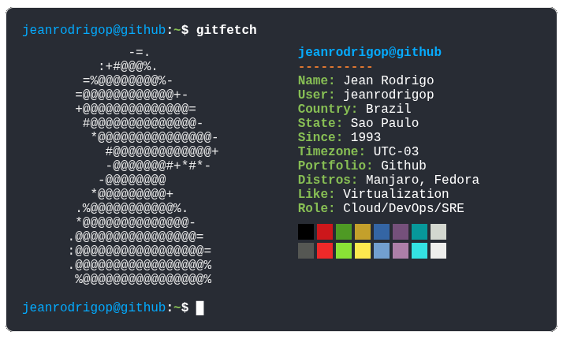

# Hello Git!

    
  

#

<!-- Badges Logos -->
![Linux][badge-linux]  ![Windows][badge-windows] ![FreeBSD][badge-bsd] ![MacOS][badge-mac] ![AWS][badge-aws] ![Azure][badge-azure] ![Bash][badge-bash] ![Git][badge-git] ![Vim][badge-vim] ![VSCode][badge-vscode] ![Zabbix][badge-zabbix] ![Grafana][badge-grafana] ![Docker][badge-docker] ![Manjaro][badge-manjaro]
<!-- Badges -->
[badge-linux]: https://img.shields.io/badge/-Linux-0a0a0a?style=flat-square&logo=linux&logoColor=white
[badge-bsd]: https://img.shields.io/badge/-FreeBSD-a53232?style=flat-square&logo=freebsd&logoColor=white
[badge-mac]: https://img.shields.io/badge/-MacOS-696969?style=flat-square&logo=apple&logoColor=white
[badge-aws]: https://img.shields.io/badge/-AWS-e39f3d?style=flat-square&logoColor=white&logo=icloud
[badge-bash]: https://img.shields.io/badge/-Bash-0a0a0a?style=flat-square&logo=gnubash&logoColor=white
[badge-git]: https://img.shields.io/badge/-Git-e46c56?style=flat-square&logo=git&logoColor=white
[badge-vim]: https://img.shields.io/badge/-Vim-3c9b5d?style=flat-square&logo=vim&logoColor=white
[badge-zabbix]: https://img.shields.io/badge/-Zabbix-e54545.svg?style=flat-square&logoColor=white
[badge-grafana]: https://img.shields.io/badge/-Grafana-e18751?style=flat-square&logo=grafana&logoColor=white
[badge-docker]: https://img.shields.io/badge/-Docker-4672d8?style=flat-square&logo=docker&logoColor=white
[badge-manjaro]: https://img.shields.io/badge/-Manjaro-35bfa4?style=flat-square&logo=manjaro&logoColor=white
<!-- To be added -->
[badge-terraform]: https://img.shields.io/badge/-Terraform-7A59A1?style=flat-square&logo=terraform&logoColor=white
[badge-helm]: https://img.shields.io/badge/-Helm-1C1F70?style=flat-square&logo=helm&logoColor=white
[badge-k8s]: https://img.shields.io/badge/-Kubernetes-516EC3?style=flat-square&logo=kubernetes&logoColor=white
[badge-actions]: https://img.shields.io/badge/-GitHub_Actions-5987DC?style=flat-square&logo=githubactions&logoColor=white
[badge-ansible]: https://img.shields.io/badge/-Ansible-000000?style=flat-square&logo=ansible&logoColor=white
[badge-python]: https://img.shields.io/badge/-Python-374E66?style=flat-square&logo=python&logoColor=white
[badge-go]: https://img.shields.io/badge/-Golang-374E66?style=flat-square&logo=go&logoColor=white
[badge-elastic]: https://img.shields.io/badge/-Elastic-374E66?style=flat-square&logo=elastic&logoColor=white
[badge-dynatrace]: https://img.shields.io/badge/-Dynatrace-374E66?style=flat-square&logo=dynatrace&logoColor=white
<!-- To be added End-->
<!-- Base64 Badges-->
[badge-windows]: https://img.shields.io/badge/-Windows-4672d8.svg?style=flat-square&logoColor=white&logo=data:image/svg%2bxml;base64,PHN2ZyB4bWxucz0iaHR0cDovL3d3dy53My5vcmcvMjAwMC9zdmciIHZpZXdCb3g9IjAgMCAxMjggMTI4Ij48cGF0aCBmaWxsPSIjZmZmZmZmIiBkPSJNNjcuMzI4IDY3LjMzMWg2MC42NjlWMTI4SDY3LjMyOHptLTY3LjMyNSAwaDYwLjY2OVYxMjhILjAwM3pNNjcuMzI4IDBoNjAuNjY5djYwLjY2OUg2Ny4zMjh6TS4wMDMgMGg2MC42Njl2NjAuNjY5SC4wMDN6Ii8+PC9zdmc+
[badge-azure]: https://img.shields.io/badge/-Azure-4672d8.svg?style=flat-square&logoColor=white&logo=data:image/svg%2bxml;base64,PHN2ZyB4bWxucz0iaHR0cDovL3d3dy53My5vcmcvMjAwMC9zdmciIHZpZXdCb3g9IjAgMCAxMjggMTI4Ij48cGF0aCBkPSJNNDMuOTgzIDQuNjUzYTUuOTExIDUuOTExIDAgMDE1LjYgNC4wMjJsMzUuOTEgMTA2LjM5NmE1LjkxMSA1LjkxMSAwIDAxLTUuNjAzIDcuODAyaDQxLjM4YTUuOTE3IDUuOTE3IDAgMDA0LjgtMi40NjUgNS45MDkgNS45MDkgMCAwMC43OTgtNS4zNEw5MC45NjEgOC42NzJhNS45MSA1LjkxIDAgMDAtNS42MDItNC4wMjJ6bS0xLjMzNi40NzhhNS45MiA1LjkyIDAgMDAtNS42MSA0LjAyOUwxLjEzMiAxMTUuNTVhNS45MSA1LjkxIDAgMDA1LjYgNy44aDI4Ljg5M2MxLjIzOSAwIDIuNDQ2LS40MSAzLjQ1Mi0xLjExM2E1LjkyMyA1LjkyMyAwIDAwMi4xNTctMi45MTZsNy4wMTktMjAuNzEtMTMuNDExLTEyLjg1N2MtLjI0Ni0uMjczLTEuMzUzLTIuMjc0LS4zNjktNC4wMDIgMS4xMDgtMS42NTkgMi45NTUtMS42NTkgMi45NTUtMS42NTloMTcuMjg1bDkuMDc0LTI2LjE0NUw0OC4yNzQgOC4zMjFjLS4wNDItLjIwNS0uOTE0LTEuMzY1LTIuMjgxLTIuMjgtMS4zNy0uOTE1LTMuMzQ1LS45MDktMy4zNDUtLjkwOXptLTQuODggNzUuNzRhMi43MjQgMi43MjQgMCAwMC0xLjg2IDQuNzE4bDM3LjgzIDM1LjMxYzEuMTAxIDEuMDMgMi41MDIgMS42MzEgNC4wMDcgMS42MzEgMCAwIDEuMjgyLjA2OCAyLjA1NS0uMDMzIDEuODE3LS4yNzMgMy41MjUtMS43NjggNC4wOS0yLjM5IDEuNDU3LTEuOTM5Ljc5NC00Ljk1Ljc5NC00Ljk1bC0xMS40NS0zNC4yOHoiIGZpbGw9IiNmZmZmZmYiLz48L3N2Zz4=
[badge-vscode]: https://img.shields.io/badge/-VSCode-4672d8.svg?style=flat-square&logoColor=white&logo=data:image/svg%2bxml;base64,PHN2ZyB4bWxucz0iaHR0cDovL3d3dy53My5vcmcvMjAwMC9zdmciIHZpZXdCb3g9IjAgMCAxMjggMTI4Ij48cGF0aCBmaWxsLXJ1bGU9ImV2ZW5vZGQiIGQ9Ik05MC43NjcgMTI3LjEyNmE3Ljk2OCA3Ljk2OCAwIDAgMCA2LjM1LS4yNDRsMjYuMzUzLTEyLjY4MWE4IDggMCAwIDAgNC41My03LjIwOVYyMS4wMDlhOCA4IDAgMCAwLTQuNTMtNy4yMUw5Ny4xMTcgMS4xMmE3Ljk3IDcuOTcgMCAwIDAtOS4wOTMgMS41NDhsLTUwLjQ1IDQ2LjAyNkwxNS42IDMyLjAxM2E1LjMyOCA1LjMyOCAwIDAgMC02LjgwNy4zMDJsLTcuMDQ4IDYuNDExYTUuMzM1IDUuMzM1IDAgMCAwLS4wMDYgNy44ODhMMjAuNzk2IDY0IDEuNzQgODEuMzg3YTUuMzM2IDUuMzM2IDAgMCAwIC4wMDYgNy44ODdsNy4wNDggNi40MTFhNS4zMjcgNS4zMjcgMCAwIDAgNi44MDcuMzAzbDIxLjk3NC0xNi42OCA1MC40NSA0Ni4wMjVhNy45NiA3Ljk2IDAgMCAwIDIuNzQzIDEuNzkzWm01LjI1Mi05Mi4xODNMNTcuNzQgNjRsMzguMjggMjkuMDU4VjM0Ljk0M1oiIGNsaXAtcnVsZT0iZXZlbm9kZCIgZmlsbD0iI2ZmZmZmZiIvPjwvc3ZnPg==
<!-- Base64 Badges End-->
<!-- Badges End-->

#

From SysAdmin to DevOps 

- Studying
- Learning
- Applying
- Understanding

>"Power comes not from knowledge kept but from knowledge shared" ― Bill Gates

<h1></h1>

###

  

###
